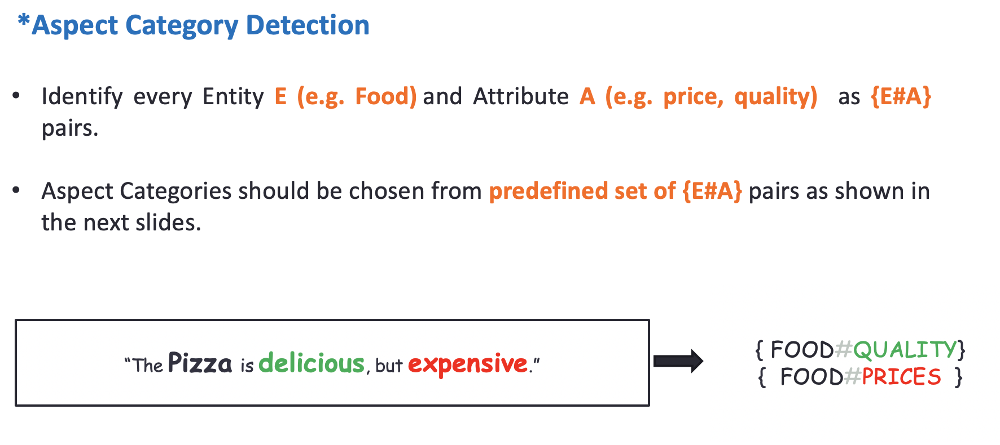

# Sentence-Aspect-Category-Detection
### Multi-Lable category detection from restaurant reviews

# Description
This is the software that accompanies the paper "[Understanding Citizen Issues through Reviews: A Step towards Data Informed Planning in Smart Cities](https://www.mdpi.com/2076-3417/8/9/1589)" by Noman Dilawar, Hammad Majeed. The paper describes our model for Aspect Category Detection in Aspect Based Sentiment Analysis task of SemEval-2016. For Aspect Category Detection (Subtask1/Slot1), we used multiple methods to represent a sentence vector using algebraic combination of its word vectors. Feature vector is then directly used to train a multi-layer neural network for multi-label sentence classification algorithm. The proposed model is tested on a real world online challenge (SE-ABSA 2016). The experimental results of our approach has shown the highest F1 scores and outperforms the existing approaches.

